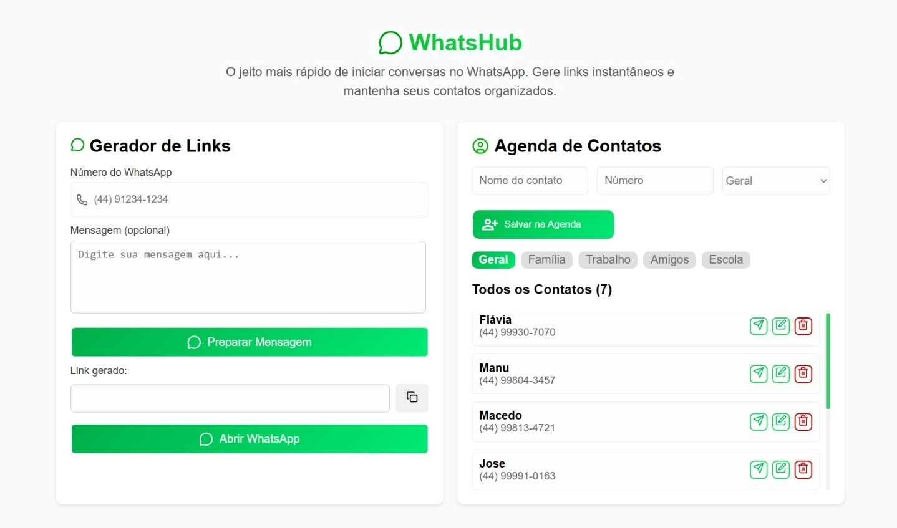

<h1 align="center" > <svg xmlns="http://www.w3.org/2000/svg" width="36" height="36" viewBox="0 0 24 24" fill="none" stroke="#009912" stroke-width="1.75" stroke-linecap="round" stroke-linejoin="round" className="lucide lucide-message-circle-icon lucide-message-circle"><path d="M2.992 16.342a2 2 0 0 1 .094 1.167l-1.065 3.29a1 1 0 0 0 1.236 1.168l3.413-.998a2 2 0 0 1 1.099.092 10 10 0 1 0-4.777-4.719"/></svg>
WhatsHub
</h1>

  <svg xmlns="http://www.w3.org/2000/svg" width="24" height="24" viewBox="0 0 24 24" fill="none" stroke="#28fb4b" stroke-width="2" stroke-linecap="round" stroke-linejoin="round" class="lucide lucide-plane-icon lucide-plane"><path d="M17.8 19.2 16 11l3.5-3.5C21 6 21.5 4 21 3c-1-.5-3 0-4.5 1.5L13 8 4.8 6.2c-.5-.1-.9.1-1.1.5l-.3.5c-.2.5-.1 1 .3 1.3L9 12l-2 3H4l-1 1 3 2 2 3 1-1v-3l3-2 3.5 5.3c.3.4.8.5 1.3.3l.5-.2c.4-.3.6-.7.5-1.2z"/></svg> O jeito mais rápido e organizado de iniciar conversas no WhatsApp!  
  Gere links instantâneos e mantenha seus contatos sempre à mão.

  <a href="https://projeto-dw2-3bim.onrender.com/" target="_blank">
    🌐 <b>Acesse o projeto online</b>
  </a>

---

## <svg xmlns="http://www.w3.org/2000/svg" width="24" height="24" viewBox="0 0 24 24" fill="none" stroke="#e5ff00ff" stroke-width="2" stroke-linecap="round" stroke-linejoin="round" class="lucide lucide-sparkle-icon lucide-sparkle"><path d="M11.017 2.814a1 1 0 0 1 1.966 0l1.051 5.558a2 2 0 0 0 1.594 1.594l5.558 1.051a1 1 0 0 1 0 1.966l-5.558 1.051a2 2 0 0 0-1.594 1.594l-1.051 5.558a1 1 0 0 1-1.966 0l-1.051-5.558a2 2 0 0 0-1.594-1.594l-5.558-1.051a1 1 0 0 1 0-1.966l5.558-1.051a2 2 0 0 0 1.594-1.594z"/></svg> Sobre o projeto

WhatsHub é uma aplicação web desenvolvida em React que facilita a comunicação via WhatsApp e a organização de contatos.
Com ele, é possível gerar links de mensagens rápidas e gerenciar uma agenda de contatos de forma prática e intuitiva.

---

## <svg xmlns="http://www.w3.org/2000/svg" width="24" height="24" viewBox="0 0 24 24" fill="none" stroke="#000000" stroke-width="2" stroke-linecap="round" stroke-linejoin="round" class="lucide lucide-image-icon lucide-image"><rect width="18" height="18" x="3" y="3" rx="2" ry="2"/><circle cx="9" cy="9" r="2"/><path d="m21 15-3.086-3.086a2 2 0 0 0-2.828 0L6 21"/></svg> Interface

  

> Interface moderna, responsiva e dividida em duas áreas principais: **Gerador de Links** e **Agenda de Contatos**.

---

## <svg xmlns="http://www.w3.org/2000/svg" width="24" height="24" viewBox="0 0 24 24" fill="none" stroke="#000000" stroke-width="2" stroke-linecap="round" stroke-linejoin="round" class="lucide lucide-settings-icon lucide-settings"><path d="M9.671 4.136a2.34 2.34 0 0 1 4.659 0 2.34 2.34 0 0 0 3.319 1.915 2.34 2.34 0 0 1 2.33 4.033 2.34 2.34 0 0 0 0 3.831 2.34 2.34 0 0 1-2.33 4.033 2.34 2.34 0 0 0-3.319 1.915 2.34 2.34 0 0 1-4.659 0 2.34 2.34 0 0 0-3.32-1.915 2.34 2.34 0 0 1-2.33-4.033 2.34 2.34 0 0 0 0-3.831A2.34 2.34 0 0 1 6.35 6.051a2.34 2.34 0 0 0 3.319-1.915"/><circle cx="12" cy="12" r="3"/></svg> Funcionalidades

### 🔗 Gerador de Links
- Campo para número do WhatsApp com máscara automática `(XX) XXXXX-XXXX`.
- Campo opcional para mensagem personalizada.
- Botão **“Preparar Mensagem”** que gera o link `wa.me` automaticamente.
- Campo de link gerado com botão para copiar.
- Botão **“Abrir WhatsApp”** que abre a conversa diretamente.

### 📇 Agenda de Contatos
- Adição de novos contatos com nome e número.
- Edição e exclusão de contatos.
- Integração com o Supabase para salvar os dados de forma persistente.
- Botão **“Mensagem”** em cada contato, preenchendo automaticamente o número no gerador de links.
- **Filtro por categoria** (💡 funcionalidade extra).

---

## 💡 Funcionalidade Extra

> 🔎 **Filtro por Categoria**

Foi implementado um sistema de **filtros dinâmicos** que organiza os contatos por categoria:  
**Geral**, **Família**, **Trabalho**, **Amigos** e **Escola**.  
Isso permite que o usuário encontre contatos de forma rápida e prática.

---

## 🛠️ Tecnologias Utilizadas

| Categoria | Tecnologias |
|------------|--------------|
| **Front-end** | React JS |
| **Back-end / Banco de Dados** | Supabase |
| **Estilização** | CSS Puro |
| **Ferramentas** | Vite, npm |

---

## 📁 Estrutura do Projeto

src/
├── components/
│ ├── ContactForm.jsx
│ ├── ContactItem.jsx
│ ├── ContactList.jsx
│ ├── EditContact.jsx
│ ├── FiltroCategoria.jsx
│ └── LinkGenerator.jsx
│
├── styles/
│ ├── ContactForm.css
│ ├── EditContact.css
│ ├── FiltroCategoria.css
│ └── LinkGenerator.css
│
├── supabaseClients/
│ └── supabaseClients.js
│
├── App.jsx
├── App.css
├── main.jsx
└── index.html

---

## ⚙️ Como executar o projeto localmente

1️⃣ Clonar o repositório

git clone https://github.com/SEU_USUARIO/WhatsHub.git
cd WhatsHub

2️⃣ Instalar as dependências
npm install

3️⃣ Criar o arquivo .env

Crie um arquivo .env na raiz do projeto e adicione as variáveis do Supabase:

VITE_SUPABASE_URL=https://SEU_PROJETO.supabase.co
VITE_SUPABASE_ANON_KEY=sua_chave_publica_aqui

⚠️ Importante: Nunca compartilhe suas chaves privadas.
Este arquivo deve estar listado no .gitignore.

4️⃣ Executar o projeto
npm run dev

O projeto será iniciado em:
👉 http://localhost:5173

🧠 Aprendizados

Durante o desenvolvimento deste projeto, foram aplicados conceitos fundamentais de:

Componentização e reuso de código com React.

Manipulação de estado com React Hooks (useState, useEffect).

Integração com Supabase para operações CRUD.

Formatação de entradas e geração dinâmica de URLs.

Organização de contatos com filtros e categorias.

---

<h2 align="center" > <svg xmlns="http://www.w3.org/2000/svg" width="24" height="24" viewBox="0 0 24 24" fill="none" stroke="#00b609ff" stroke-width="2" stroke-linecap="round" stroke-linejoin="round" class="lucide lucide-users-icon lucide-users"><path d="M16 21v-2a4 4 0 0 0-4-4H6a4 4 0 0 0-4 4v2"/><path d="M16 3.128a4 4 0 0 1 0 7.744"/><path d="M22 21v-2a4 4 0 0 0-3-3.87"/><circle cx="9" cy="7" r="4"/></svg>
Autores
</h2>

 <b>Maria Eduarda Macedo de Souza</b> 💚   mariasouza.2008@alunos.utfpr.edu.br   <b>Emanuelle de Britto Moura Santos</b> 💚   emanuelle.2008@alunos.utfpr.edu.br   Projeto da disciplina de Desenvolvimento Web II - 3º Bimestre 
 
 Feito com 💚 usando <b>React</b> + <b>Supabase</b>     
